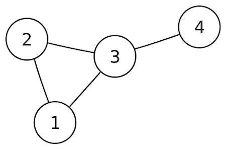

# Introduction to Graph Theory
> mathematical theory of the properties and applications of graphs (networks)

Introduction vid: https://www.youtube.com/watch?v=LFKZLXVO-Dg

__FreeCodeCamp__: https://www.youtube.com/watch?v=09_LlHjoEiY

# Some theories and concepts
A graph $G = (V, E)$ is a set of vertices V and edges E where each edge (u, v) is a connection between vertices. $u, v \in E $

Edge set = $\{(1, 2), (1, 3), (2, 3), (3, 4)\}$
- Types of graphs:
    + Directed Graph
    + Undirected Graph
    + Weighted Graph: (u, v, w) -> u, v for vertices on the two ends, w for weight
    + More special graphs include:
        * trees (undirected graphs with no cycle)
        * rooted trees: with a root node that edges point away or towards it
        * Directed Acyclic Graphs (DAGs): representing structures with dependencies
        * Bipartite graphs
        * Completed Graphs
- Representing graphs: the data structures for graphs would be adjacency matrices and adjacency lists, and the less popular edge lists
    + Adjacency Matrix:
$$
\mathrm{A_{i, j}} = \begin{cases}
    1 & \text{for edge} (i, j) \\ % & is your "\tab"-like command (it's a tab alignment character)
    0 & \text{otherwise.}
\end{cases}
$$
# Applications in Graphs
- Mapping: navigation from one point to another point - shortest path problem
    + BFS (unweighted), Dijkstra's, Bellman-Ford, Floyd-Warshall, A*,...
- Connectivity: does there exist a path between two vertices
- Does the graph contain cycles, is it connected?
- Given a set of k colors, can we assign colors to each vertex so that no two neighhbors are assigned the same color
- Minimum Spanning Tree (least cost network, circuit design, transportation networks) - Kruskal's, Prim's
- Negative cycles: Bellman-Ford, Floyd-Warshall
- Sudoku problems
- Social network
- Network flow: max flow