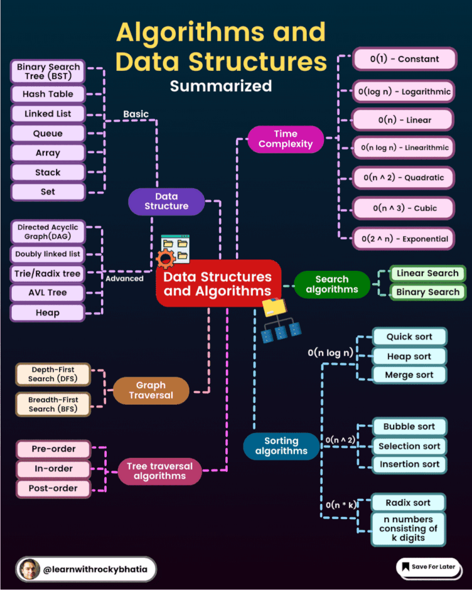

# Data Structures and Algorithms

   <b>Rudimentary foundations for computer programmings and backbones for AI and ML theories </b>

## Sorting
- [x] Insertion Sort 
- [x] Heap Sort
- [] Selection Sort
- [x] Merge Sort
- [x] Quick Sort
- [] Counting Sort
- [x] Bubble Sort
- [] Radix Sort
- [] Bucket Sort

## Graphs
- [x] Kruskal's Algorithm
- [] Djikstra's Algorithm
- [] Bellman-Ford Algorithm
- [] Floyd Warshall Algorithm
- [] Prim's Algorithm
- [x] Topological Sort Algo
- [] Flood Fill Algorithm
- [] Lee Algorithm

## Searching
- [x] Linear Search
- [x] Binary Search
- [x] Breadth First Search
- [x] Depth First Search

## Arrays
- [] Kadane's Algorithm
- [] Floyd's Cycle Detection Algorithm
- [] KMP Algorithm
- [] Quick Select Algorithm
- [] Boyer - More Majority Vote Algorithm

## Basics
- [] Huffman Coding Compression Algorithm
- [] Euclid's Algorithm
- [] Union Find Algorithm

## Mathematical Algorithm
- [x] Horner's Evaluation

## Miscellaneous
- [x] Tower of Hanoi
- [] Knapsack Problem
- [] Travelling Salesman Problem
- [] Dynamic Programming

# The Maths you need for Computer Science

Mathematics plays a fundamental role in computer science, as it provides the theoretical foundation for many computer science concepts and algorithms. Here are some of the key mathematical areas that are important for computer science:

1. **Discrete Mathematics**:
   - **Logic**: Propositional logic, predicate logic, and their applications in algorithm design and reasoning.
   - **Set Theory**: Understanding sets, set operations, and set theory is fundamental in computer science.

2. **Algebra**:
   - **Linear Algebra**: Used in computer graphics, machine learning, and optimization algorithms.
   - **Abstract Algebra**: Particularly group theory, which is used in cryptography.

3. **Calculus**:
   - **Differential Calculus**: Used in algorithm analysis, optimization, and physics simulations.
   - **Integral Calculus**: Important in various algorithms, such as those used in numerical analysis.

4. **Probability and Statistics**:
   - Probability theory is essential for understanding randomness and uncertainty in algorithms.
   - Statistics is crucial for data analysis, machine learning, and experimental design.

5. **Graph Theory**:
   - Used in network and graph algorithms, like those used in social networks or routing algorithms.
   
6. **Number Theory**:
   - Crucial for cryptography, including the development of secure encryption algorithms.

7. **Combinatorics**:
   - Used in algorithm analysis and counting problems, like permutations and combinations.

8. **Automata Theory**:
   - Understanding formal languages, finite automata, regular expressions, and context-free grammars is essential for understanding compilers and the theory behind regular expressions.

9. **Complexity Theory**:
   - Knowledge of Big O notation and the classification of algorithms according to their time and space complexity.

10. **Linear Programming and Optimization**:
   - Linear programming is used in optimization problems that arise in various computer science applications.

The specific mathematical requirements can vary depending on the area of computer science you're interested in. For example, if you're focusing on computer graphics, you might need more linear algebra and geometry. If you're diving into machine learning and AI, you'll need a strong background in linear algebra and statistics. If you're interested in cryptography, number theory and abstract algebra become more important.

It's important to note that while a strong foundation in mathematics is beneficial, many practical programming and software development tasks in computer science can be accomplished without an in-depth knowledge of advanced mathematics. However, understanding the mathematical underpinnings can help you design more efficient algorithms, troubleshoot complex issues, and develop a deeper appreciation for the field.

# Resources 
- https://www.tutorialspoint.com/data_structures_algorithms/index.htm
- https://www.geeksforgeeks.org/fundamentals-of-algorithms/?ref=shm